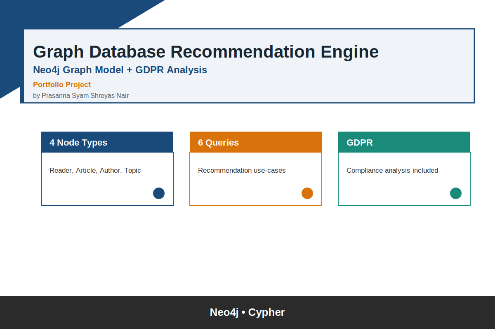
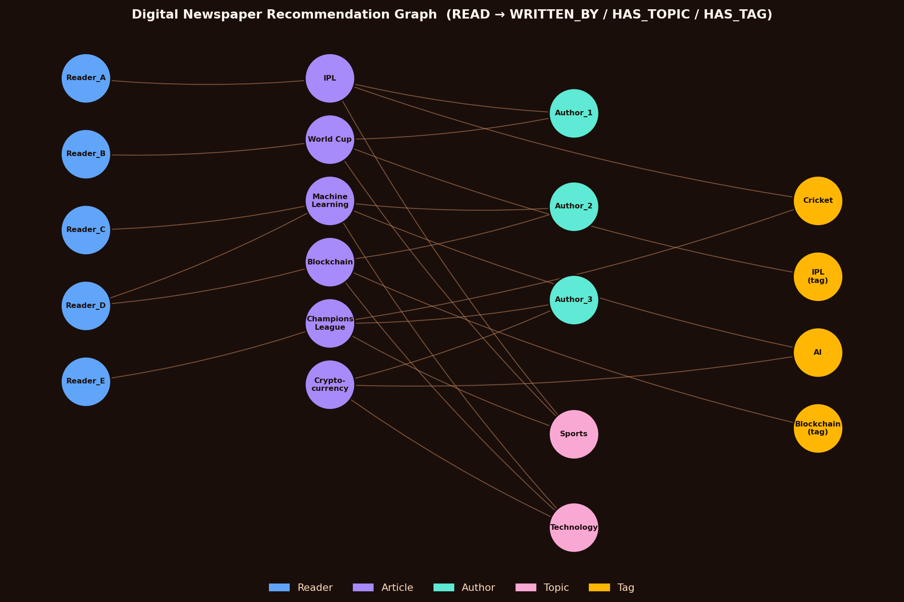

# Graph Database Design — Digital Newspaper Recommendation Engine

A Neo4j graph database modeling a digital newspaper's readers, articles, authors, topics, and tags — built to power article recommendations — plus an analysis of GDPR compliance considerations for maintaining that kind of graph.

## Why a graph database

Recommendation-style problems (find related content, similar users, trending topics) involve traversing many-to-many relationships — reader→article→topic→other readers, and so on. A relational database would need repeated joins across multiple tables for these traversals; a graph database expresses them natively as relationship traversals, which is both faster and easier to reason about.

## Data model
- **Reader** → `READ` → **Article**
- **Article** → `WRITTEN_BY` → **Author**
- **Article** → `HAS_TOPIC` → **Topic**
- **Article** → `HAS_TAG` → **Tag**

## Queries (`queries.cypher`)
Six use cases built on this model:
1. Recommend articles to a reader based on reading history
2. Identify readers likely to engage with new articles on a given topic
3. Surface trending topics among readers with similar interests
4. Recommend related articles via shared tags
5. Find authors a reader hasn't discovered yet, on topics they like
6. Classify readers as "Power User" vs. "Light User" by engagement

## GDPR considerations
The accompanying analysis covers the compliance implications of storing reader behavior (reading history, inferred interests) in a graph structure — right to erasure in a highly-interconnected data model, data minimization, and purpose limitation for recommendation profiling.

## Tech
Neo4j, Cypher
